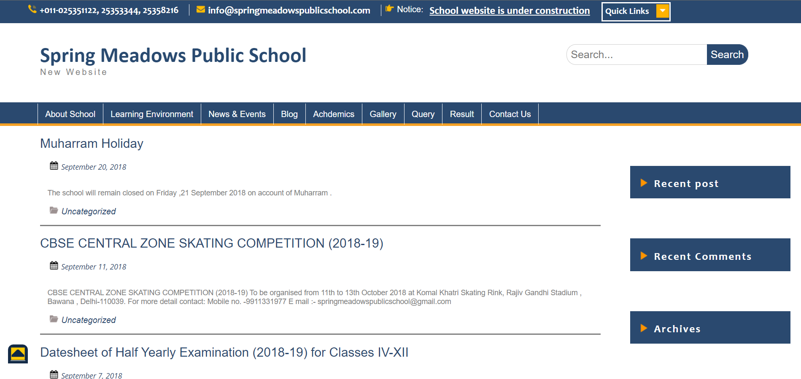

# Project Name

This is my first website which i created in my 10th class as my school project and after making this, I got to know that "Yes I can code".At the beginning stage in the making of this website I was not aware of css, Html is only lanuague which our school taught us and when they assigned us this school project, I learned the css from youtube on my own, and I'm really proud of this website.

       &ensp;
       
 

## Prerequistes

HTML and CSS
 
 

---

## Find Me On

<a href="https://www.instagram.com/karancodes/">Instagram</a> &ensp;
<a href="https://codepen.io/karan-kmr">Codesandbox</a> &ensp;
<a href="https://codesandbox.io/u/karan-kmr">Dev.to</a> &ensp;

